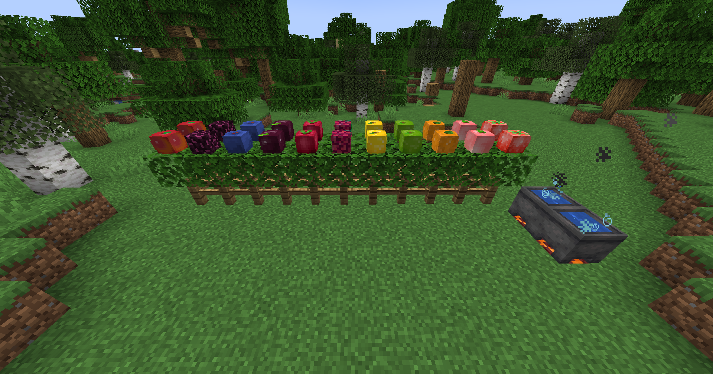

# BreweryGarden

### This addon adds plantable seeds and fruits to BreweryX which can be used in recipes and cauldron ingredients.

As stated above, this addons adds plants to BreweryX. You can get plant seeds by breaking
either `short grass` or `tall grass` blocks which are customizable in this addons 
configuration (<ins>plugins/BreweryX/addons/BreweryGarden/config.yml</ins>).

You may also get seeds or plants manually via commands using `/breweryx garden give <args>`.

Plants will grow similarly to normal Minecraft plants or crops.

Data about plants will be saved directly to your assigned BreweryX DataManager (FlatFile, MongoDB, etc.)
and can be accessed across servers if worlds are identical, and you're using an external database such as Mongo or MySQL.

#### You must be using BreweryX 3.4.5-SNAPSHOT or later to run this addon!
